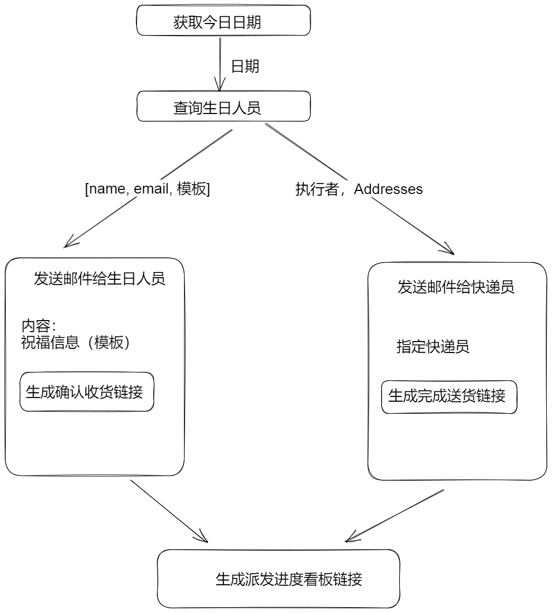

# Scene
A low code platform can help those who knows bussiness workflow well but aren't good at programming to build a website or application easily in order to improve their team's work efficiency and make their workflow more clear and automated. 

But also, it is an application developpment method that help a team to rapidly implement the users' demand.

Here's an example:

One wants to send presents on stuff's birthday and to keep following the delivery process.

So he comes up a workflow as follows: 



Now, we wants to automatically generate an application based on this, including a server and a clint.

# First, parse the graph
The generator or the low-code platform can not generate an application just according to a graph, the first step is to define a format to describle this workflow. (And it's the frontend's job to generate it)

Maybe like this `order | function | input |output` or `order | function |output`:
```
1 | query_date | date
2 | query_birth_stuff | date | stuff
3 | query_address_and_email | stuff
4 | generate_url | stuff_num | urls1 urls2 url3
5 | inform_stuff | stuff content urls1 | result
6 | inform_sender | stuff address urls2 | result
7 | return | url3
```

# Second, parse above format into Protocol Buffer

Maybe like this:
```proto3
syntax = "proto3"

message 
```